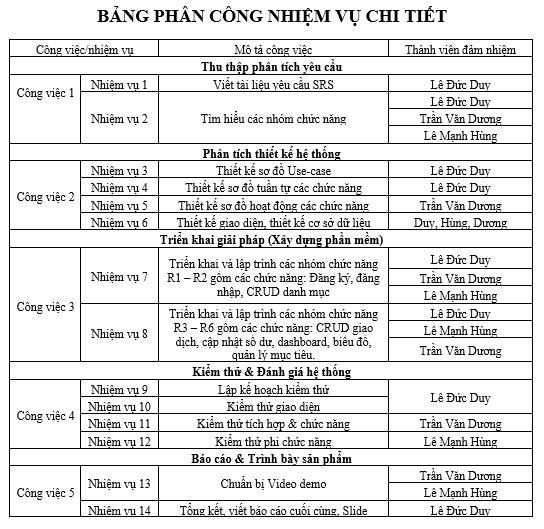

# 💰 Ứng dụng Quản Lý Tài Chính Cá Nhân

## 👨‍🏫 Giảng viên hướng dẫn [TS. Phạm Ngọc Hưng]

## 👨‍💻 Nhóm sinh viên thực hiện
- [Lê Đức Duy] - MSSV: [23010772]
- [Trần Văn Dương] - MSSV: [23010244]
- [Lê Mạnh Hùng] - MSSV: [23010123]

---

## 📌 Giới thiệu
Ứng dụng Quản lý tài chính cá nhân giúp người dùng theo dõi thu nhập, chi tiêu và kiểm soát tài chính một cách hiệu quả. Hệ thống hỗ trợ quản lý giao dịch, phân loại danh mục và thống kê dữ liệu.

---

## 🎯 Mục tiêu
- Quản lý thu nhập và chi tiêu
- Theo dõi các giao dịch tài chính
- Phân loại danh mục (ăn uống, học tập, giải trí...)
- Thống kê và báo cáo

---

## 🏗️ Kiến trúc hệ thống
Ứng dụng được xây dựng theo:

- Mô hình **MVVM (Model - View - ViewModel)** trong WPF  
- Kiến trúc **3 tầng (3-Tier Architecture)**:
  - Giao diện (UI)
  - Xử lý nghiệp vụ (Business Logic)
  - Truy cập dữ liệu (Data Access)

---

## 📂 Cấu trúc dự án

---

## 🔄 Luồng hoạt động của hệ thống

### 1. Luồng đăng nhập (R1)
Người dùng nhập email và mật khẩu  
→ Giao diện nhận dữ liệu  
→ ViewModel gửi yêu cầu đăng nhập  
→ AuthService kiểm tra thông tin  
→ Repository truy vấn bảng User trong database  
→ Nếu thông tin hợp lệ:
  → Đăng nhập thành công  
  → Chuyển đến màn hình chính  
→ Nếu không hợp lệ:
  → Hiển thị thông báo lỗi  

---

### 2. Luồng quản lý giao dịch (R2, R3, R4)

#### Thêm giao dịch
Người dùng nhập thông tin (số tiền, loại, danh mục)  
→ View gửi dữ liệu đến ViewModel  
→ ViewModel kiểm tra dữ liệu hợp lệ  
→ TransactionService xử lý  
→ Repository lưu vào database  
→ Cập nhật lại danh sách giao dịch  

#### Sửa / Xóa giao dịch
Người dùng chọn giao dịch  
→ ViewModel nhận yêu cầu  
→ Gọi TransactionService  
→ Repository cập nhật hoặc xóa dữ liệu  
→ Cập nhật lại giao diện  

---

### 3. Luồng quản lý danh mục (R5)
Người dùng thêm/sửa/xóa danh mục  
→ View gửi yêu cầu  
→ ViewModel xử lý  
→ CategoryService thực hiện  
→ Repository thao tác database  
→ Trả kết quả về giao diện  

---

### 4. Luồng thống kê (R6)
Người dùng truy cập màn hình thống kê  
→ ViewModel yêu cầu dữ liệu  
→ Service tổng hợp dữ liệu thu/chi  
→ Repository lấy dữ liệu từ database  
→ Trả dữ liệu về ViewModel  
→ Hiển thị trên giao diện  

---

### 5. Luồng tổng quát hệ thống
Người dùng thao tác trên giao diện  
→ View (UI)  
→ ViewModel  
→ Service (xử lý nghiệp vụ)  
→ Repository (truy cập dữ liệu)  
→ Database  
→ Trả kết quả ngược lại View  

---

---

## 🧱 Công nghệ sử dụng
- C#
- WPF (.NET)
- SQL Server
- Entity Framework

---

## ⚙️ Chức năng chính
- Đăng nhập / Đăng ký
- Quản lý giao dịch
- Quản lý danh mục
- Thống kê thu chi...

---

## 🚀 Hướng phát triển

